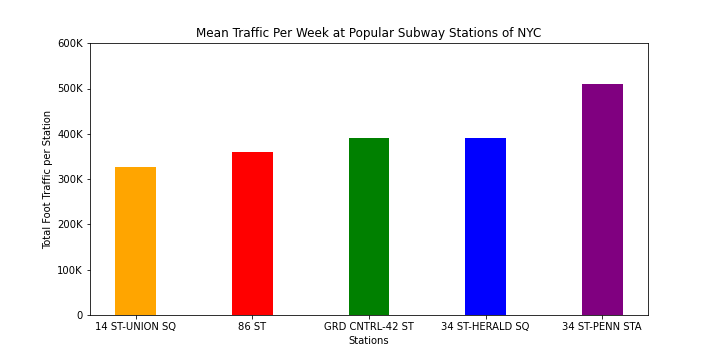

## Analysis of the NYC Turnsile MTA Data
The aim of this project is to determine the best subway station locations for the WomenTechWomenYes (WTWY) street teams to canvas to receive a high turnout at their summer gala.

The data was first collected from the MTA turnstile website over a five month period. This data was given a unique identifier and cleaned. The “RECOVR AUD” data was removed. The time series of “00:00:00 & 04:00:00” were removed, and Saturday and Sunday were removed. The entries and exits were also turned into net entries and exits using a shift in the data, after the data was ordered correctly.

The figure below shows the mean number of entries plus exits over any given week over the five month period. The five most trafficked stations are represented.

After the five most trafficked stations were found, the data was parsed into days of the week. The mean number of travelers by day of the week for the five most popular stations is shown below.

To try to draw more meaningful conclusions for WTWY, weather data was brought in from the National Oceanic and Atmospheric Administration's (NOAA) website. This information was collected daily at Central Park, NYC and contained the maximum and minimum temperatures for each day. An average temperature for each day was found and merged with a data frame relating average temperature to total subway movement over each given date. These temperatures were gathered into ranges and an average population movement by temperature range was found and plotted below. This chart can show that there tends to be more people moving during warmer weather periods.

